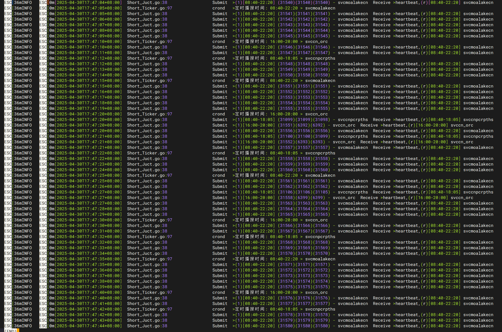
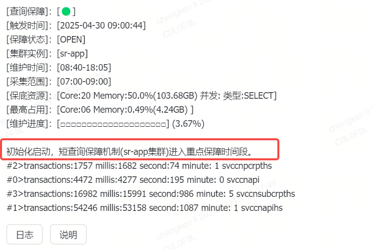
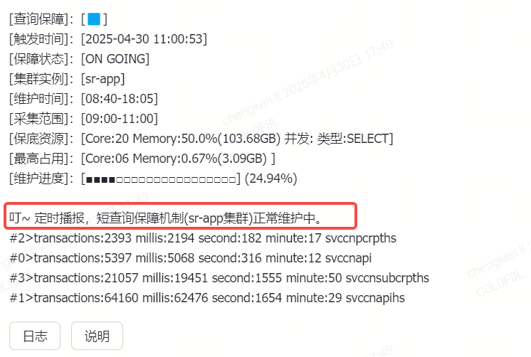
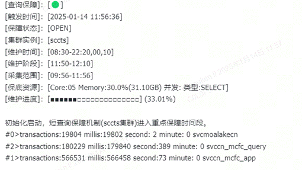
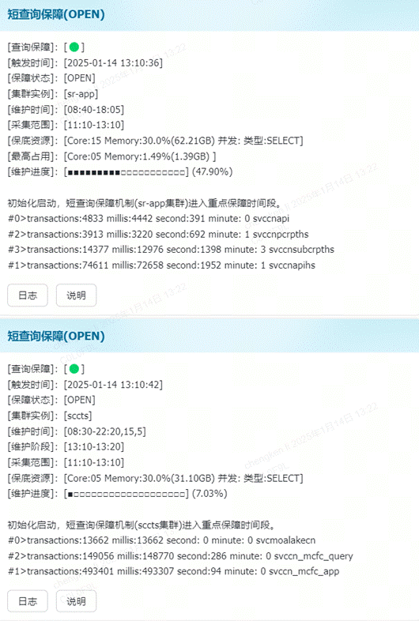

在StarRocks中的短查询保障机制是如何运行的

**一、保障模式**

1. **资源隔离****(MAX)**

限制某个账号，相对应使用的CPU、内存、并发、扫描行数...进行限制。 用户集群： 个人账号：最高能使用10Core，50%内存，3并发。 公共账号：数据团队不限制，其他团队最高能使用10Core，50%内存，50并发。 专有集群： 公共账号：报表账号最高能使用20Core，50%内存，200并发。  
 <u>超出阈值则进入等待队列，待前面的高消耗完成后，后面的的语句才能进入运行队列。</u>  

2. **资源隔离****(MIN)**

（一个集群，只能拥有一个短查询保障简称Short
 Query组） 限制某个账号，相对应使用的CPU、内存、并发、扫描行数...进行保底资源。 用户集群： 个人账号：无 公共账号：无 专有集群： 公共账号：一级报表、实时账号最低有15Core，20%内存，并发不限。  
 <u>保底资源持续稳定。</u>  

**二、全局保障**
3. **资源分配**
根据需求分配不同的资源给对应的账号、组、角色
4. **心跳**
除资源配额外，短查询保障需要心跳支持。eg.
 select 1/1s（每秒发起一个select1）已在集群运维层实现。

5. **广播**

广播模式又分3种：
1.初始化启动（早上第一次启动时出现，告知已经进入维护时间段）

2.中途广播（每隔90分钟自动广播一次，直至维护结束） 

当维护结束广播发出后，心跳机制将停止，保底资源将会有极大几率被弹性移除，程序已将进入休眠状态，待下一次的开始时间再次触发后，自动唤起。

6. **其他说明**
   面板信息：
   [查询保障]：[🟢]  //绿色代表正常运行中，红色代表陷入睡眠待唤起。 [触发时间]：[2024-11-22 09:42:15] //发送信息时间。
   [保障状态]：[OPEN] //状态，OPEN代表正常运行中、CLOSE代表已经结束维护、SLEEP代表陷入休眠(当程序进入休眠模式，比如关闭维护账号时)。
   [集群实例]：[sr-app] //集群。
   [维护时间]：[**08:31-18:01**] //维护时间段。
   [维护资源]：[[Core:15 内存:20.0% 并发: 类型:SELECT]] //分配的资源 [维护进度]：[■■□□□□□□□□□□□□□□□□□□] (12.50%) //目前的维护进度  
   初始化启动，短查询保障机制(sr-app集群)进入重点保障时间段。 

【日志】 //点击日志按钮，里面展示的是当前用户2个小时前到现在消耗时间的top10，日志并不会展示完整的查询语句信息，请根据queryId字段拿到查询ID

**三、间距保障**

2025.01.10 编写间距保障功能，2025.01.13上线。如：需要在08:00~22:00 之间，每个小时的整点，支持整点前后10分钟的保障。例如整点时间：09:00，那么保障时间就是08:50~09:10，到点挂起。等待下一个整点09:50~10:10继续保障。一直到终点(22:00)整体结束。  
 

[维护阶段]：[11:50-12:10] /*11:50启动，12:10挂起，维护整点前后20分钟*/

[采集范围]：[09:56-11:56] /*指标的采集范围*/ 

[保底资源]：[Core:15 Memory:30.0%(62.21GB) 并发: 类型:SELECT] /*目前分配给资源组的资源指标*/ 

[最高占用]：[Core:05 Memory:1.22%(1.70GB) ] /*在【采集范围】内，占用最高的资源*/

7. **备注**

**如何理解：**  
**一个短查询的保障，除了分配资源外，还需要持续发起心跳，为的是资源组内的资源持续稳定。如资源组里的用户查询语句是非常频繁的，那可以不需要心跳，因为分配资源的调度任务是很快的。**  
**如果资源组里用户几秒没发起语句，那么资源组的资源就给别人抢走了。当然了，如这时候短查询继续发起，依旧会在秒级内把资源抢回来。**
